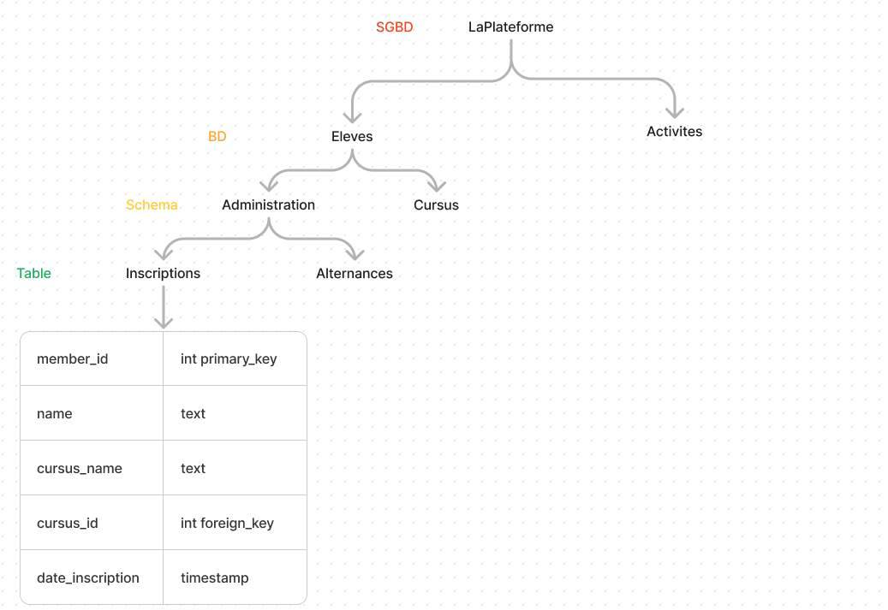
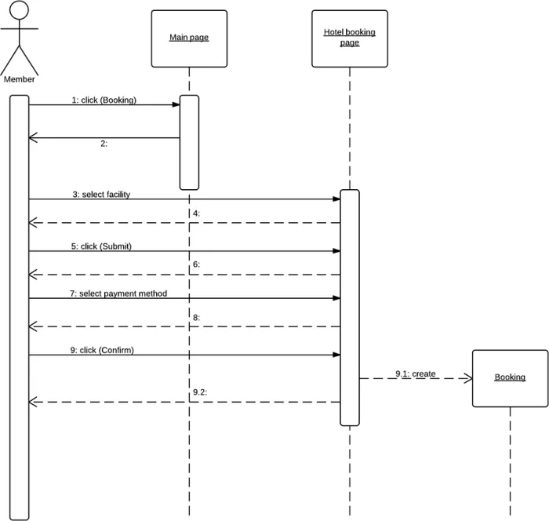

# Watch 

## Qu’est ce qu’une donnée ? Sous quelle forme peut-elle se présenter ?

En informatique, la donnée est une réprésentation de l'information qui peut être utilisée dans le traitement automatique. La donnée peut aussi se défénir par un élément "donné" qui sera la source de résonnements et recherches scientifiques.  
La donnée peut être présentes sous de nombreuses formes, que ce soit de manière concrête, abstraite mais aussi on la retrouve dans de nombreux domaines, comme les sciences, le langage mais aussi l'informatique.  
En informatique, la donnée peut être un simple bytes, mais aussi une donnée quantitative ou qualitative dans un document. Elle peut être interprétable, nominale.  

## Donnez et expliquez les critères de mesure de qualité des données.

Intrinsèquement, la donnée ne possède pas de "qualité"... Cependant, dans une optique d'analyse, d'interprétation ou d'utilisation de la donnée, il peut être intéressant de veiller à certains critère pour obtenir une qualité globale.  
- Son exactitude, veiller à ce que la donnée soit juste et vérifiée, pour éviter de la malinformations ou des raisonements sur des bases éronées.
- Sa complétude, il faut que la donnée soit complête ou très partiellement complète, sinon aucune analyse ou utilisation pourra être réalisé sur cette donnée.
- Sa cohérence, car une donnée dans un ensemble de donnée où elle n'appratient pas peut au mieux être inutile, au pire même mener sur de fausses routes.
Il existe encore d'autres critères intéressant à prendre en compte pour veiller à une bonne qualité des données.

## Définissez et comparez les notions de Data Lake, Data Warehouse et LakeHouse. Illustrez les différences à l’aide de schémas.
- Data Lake : Méthode pour stocker la donnée en grande quantité, et de manière brute et déstructurée. L'objectif est de stocké les données de plusieurs sources afin de les analyser plus tard.
- Data Warehouse : Méthode pour stocker la donnée en grande quantité de manière structurée. Les données peuvent venir de plusieurs sources mais sont toute soumises à une organisation afin de pouvoir les analyser et les utiliser par la suite.
- LakeHouse : Méthode pour stocker la donnée dynamiquement de manière flexible et à faible cout. Elle est très utile pour l'utilisation de données fiables et actualisées en temps réel.

Ainsi, On y voit des différences de structures pour des différentes utilisations. Les scientifiques préferont pour réaliser leur modèles des LakeHouse avec des données acualisées, ou alors des Warehouse pour avoir un grand nombre de données structuré. Sans la nécéssité de beaucoup d'utilisation ou d'analyse, un Data Lake est très puissant et viable.  
Voici ci-joint un très réussit schéma des différences, dans l'article de databricks.com https://www.databricks.com/glossary/data-lakehouse


## Donnez une définition et des exemples de systèmes de gestion de bases de données avec des illustrations.

Un système de gestion de bases de données (SGBD) est un logiciel de stockage, de gestion, de tri, d'organisation et d'utilisation de bases de données.  
Par exemple, le SGBD "LaPlateforme" peut contenir 2 bases de données : "Eleves" et "Activites",    
avec par exemple dans "Eleve" des schémas : "Adminisatrion", "Cursus",   
avec le schéma "Administration" qui pourrait contenir les tables : "Inscriptions", "Alternances",  
avec dans la table "Inscriptions" les colonnes : "member_id", "name", "cursus_name", "cursus_id", "date_inscription"  




## E. Qu’est ce qu’une base de données relationnelle ? Qu’est ce qu’une base de données non relationnelle ? Donnez la différence entre les deux avec des exemples d’applications.  

Une base de données relationelle est une BD qui lie les données entre elles, dans un tableau. Elle permet une accessibilité à la donnée pour l'homme, pour une meilleure lecture et compréhension.  
Une base de données non relationelle est une BD qui ne va pas lier les données entre elles, elle va permettre plus simplement un stockage avec une clé.  

## F. Définissez les notions de clé étrangère et clé primaire.
 
Une clé primaire est un index unique à un élément dans une table. Dans la même ligne, une clé étrangère est la clé primaire d'une autre table. Cette clé étrangère permettra des jointures unique à d'autres tables.   

## G. Quelles sont les propriétés ACID ?
Les propriétés ACID sont l'acronymes des propriétés suivantes : Atomicité, Cohérence, Isolation et Durabilité. Grâce à ces propriétés, toutes les transactions de base de données sont fiables et sécurisées.

## H. Définissez les méthodes Merise et UML. Quelles sont leur utilité dans le monde de l’informatique ? Donnez des cas précis d’utilisation avec des schémas.
Le Merise est une méthode pour analyser et réaliser des "systèmes d'information". Pour ce faire, on va passer par la création d'un schéma directeur, des études préalables puis détaillés jusqu'à la réalisation.
L'UML est une méthode pour représenter les aspects d'un systèmes à l'aide de diagrammes.




## I. Définissez le langage SQL. Donnez les commandes les plus utilisées de ce langage et les différentes jointures qu’il est possible de faire.

Le SQL est un langage de de manipulations de Query pour interagir avec les bases de données relationnelles.  
Le SQL contient de nombreuses query : 
- Create : Pour créer des tables, des schémas ou même des bases de données
- Select : pour afficher des lignes d'une table. La structure est ``` select *colonnes* from *table* (where *condition* group by *colonne* order by *colonne* limit *nombre*)```
- Update : Pour modifier une ligne existante 
- delete : Pour supprimer une ligne existante
- with ... as () : pour la création de CTE  
Il est possible de faire des joitures pour intéragir avec des colonnes spécifiques. Ces jointures vont lier deux tables ensemble vis à vis d'une ou plusieurs de leur colonnes respectives. Il existe plusieurs jointures :
- left join : Prendre toute les lignes de la table de gauche, et prendre ce de la table de droite lorsque la jointure est respectée (opposé donc à right join)
- inner join : Prendre uniquement les lignes qui respectent la jointure (opposé à outer join)
Il en existe d'autres plus spécifiques mais très rarement utilisés (full join, natural join pour faire une copy, self join)